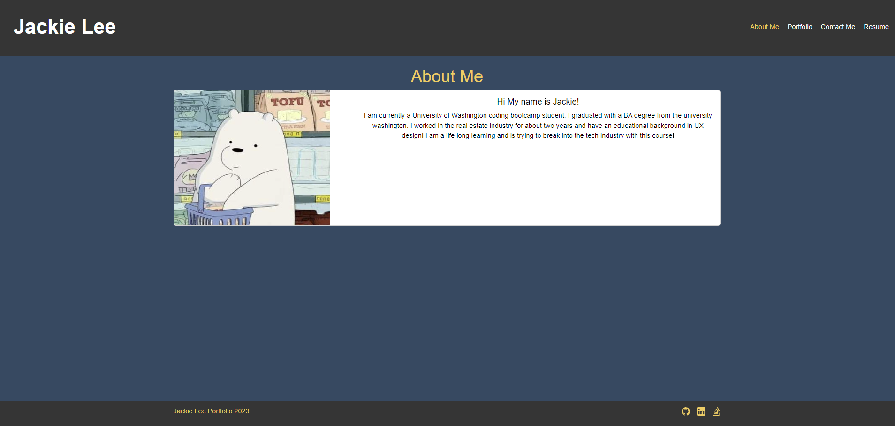
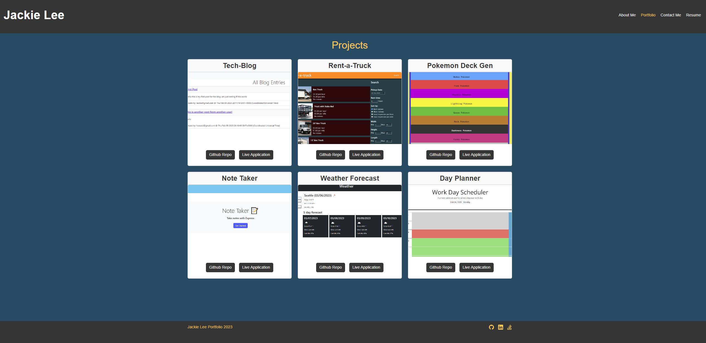

# react-portfolio
My work portfolio that was created with React

## Description

This is my work portfolio that display all the work I have done at the University of Washington coding boot camp. There is an about me page that shows a short description of myself. There is a portfolio page that shows my most recent projects that I have done. You will be able to find links to both the github repository to the project as well as the live link to the project. There's a contact form that you can use to contact me and a resume page where you can see the technlogy I know and a copy of my resume for download. 

What I learned from this project is the usage of react for my front end. I learned to use JSX and components to put together a front end site. I also learned how to deploy react into github pages. 

## Installation

After cloning all the files from the respository. You need to open terminal or command line to so we can use a script to run our client. You will need to enter in "npm run start" so react knows to start the client. Then go to localhost:3000 in  your browser.

## Usage
- install node.js
- npm run start
- go to localhost:3000 in your browser
- check out my porfolio

[link to live page](https://jjackielee.github.io/react-portfolio)

## Credits

N/A

## License

N/A

---

## Features

My work portflio that shows you an about me page, a portfolio page with links to projects, contact page and a resume page that shows my ability and resume.